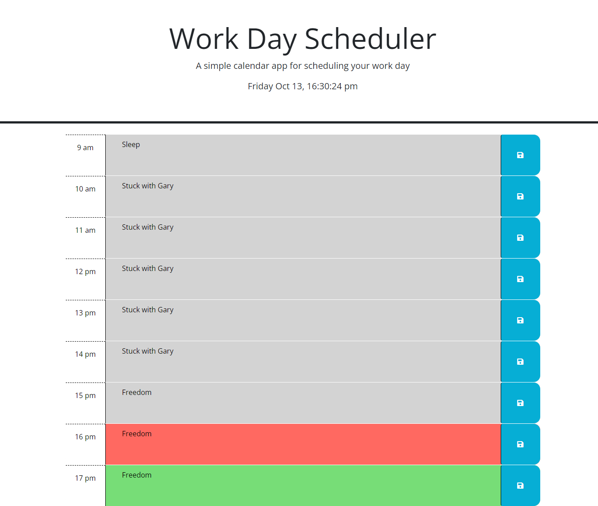

# **Module 5 Challenge:** 9-5 Schedule Planner

## Description

The goal of this project was to create a 9-5 planner in which the user could save their plans for certain hours for viewing at a later date. The back-end code enables this using local storage that triggers off of an event listener tied to the buttons at the end of the rows. Using distinct class names for each row's textarea and button elements helped to ensure that the correct values were being recorded. These distinct class names are generated when the page loads, as the rows themselves are dynamically generated through JavaScript. The usage of dayjs was critical in developing this project.

## Preview

The project can be found at [this address](https://zschreier.github.io/schedule-keeper/).

The following screenshot provides an example of how the page may look after saving some information:
